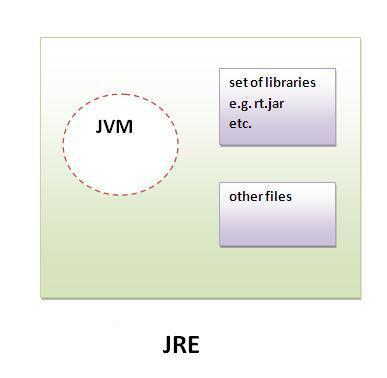
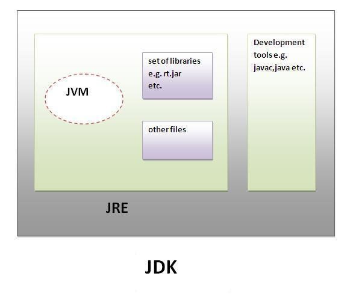

import Box from '@mui/material/Box';

<Box sx={{textAlign: 'justify'}}>

# JVM, JRE va JDK

## 1. JVM

Java Virtual Machine `(JVM)` ning vazifasi tarjimonlik ya'ni, dastlab biz yozgan `*.java` fayl kompilyator yordamida baytkodga o'giriladi va `JVM` yordamida mashina tiliga aylantiriladi. Bu degani `JVM` qaysi platformaga tegishli bo'lsa, kodlarni ham o'sha platformaga moslab beradi.
JVM ni ko'pgina qurilmalar va dasturiy ta'minotlar uchun ishlatish mumkin. Har bir OT(operatsion tizim) uchun `JVM`, `JRE` va `JDK` lar konfugratsiyasi farq qiladi, chunki bular platformaga bog'liq. Lekin java mustaqil platforma hisoblanadi.  

`JVM` komponentlari quyidagilardir:
    - Class Loaders
    - Run-Time Data Areas
    - Execution Engine

<!-- ### 1.1 Class Loaders

Java virtual mashinasida `(JVM)` sinf yuklovchi `(Class Loaders)` java sinflarini `JVM` ga yuklash uchun javobgardir.

Sinf yuklagichi bir nechta asosiy funktsiyalarni bajaradi:
    - Loading - java sinfi uchun bayt kodini o'z ichiga olgan sinf faylini (odatda fayl tizimi yoki tarmoqdan) topadi va o'qiydi.

    - Linking - sinfni yuklagandan so'ng, sinf yuklovchisi tekshirish, tayyorlash va ixtiyoriy ravishda hal qilishni o'z ichiga olgan ulanishni amalga oshiradi

    - Initialization - sinf yuklovchisi sinfning statik ishga tushirgichlari va statik bloklarini bajarish orqali sinfni ishga tushiradi. Ushbu qadam sinf haqiqatda ishlatilgunga qadar (ya'ni, kodda havola qilinmaguncha) kechiktiriladi

:::info Class Loaders
    - Bootstrap Class Loader
    - Extension Class Loader
    - System Class Loader
::: -->

## 2. JRE

Java Runtime Environment `(JRE)` - tushunish uchun `Java bajarilish muhiti` deb atasak bo'ladi.  
Java'da yaratilgan dasturlar turli OT (operatision tizim) larda bajarilishi uchun `jre` kifoya.  

    > Dasturchi bo\'lmagan oddiy foydalanuvchilarda Java dasturlari bajarilishi uchun `JRE` yetarlidir.

    

`JRE` - jvm, bazi java kutubxonlari va ma'lumbir file'lardan jamlanganligi yuqoridagi rasmdan ko'rishingiz mumkin

## 3. JDK

Java Development Kit `(JDK)` Java dasturini ishlab chiqish, kompilyatsiya qilish, disk raskadrovka qilish va bajarish uchun muhit va vositalarni taqdim etadi.

`JDK` ning asosiy komponentlariga quyidagilar kiradi:
    - JRE
    - Development Tools

    

</Box>