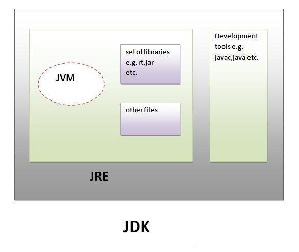

--- 
sidebar_position: 5
title: "O'zgaruvchilar" 
--- 
 
import Box from '@mui/material/Box'; 
 
<Box sx={{textAlign: 'justify'}}> 
 
# Java-da o'zgaruvchilar

## Static va dynamic dasturlash tillari

Statik (Static) va Dinamik (Dynamic) dasturlash tillari dasturlarni turli yo'llar bilan kompilyatsiya qilish va bajarishni tashkil etadigan ikkita asosiy dasturlash tillari toifasidir. 

### Static dasturlash tillari 

Statik dasturlash tillari bu kompilyatsiya vaqtida (compile-time) kodning ko'p qismini tekshiradigan va aniqlaydigan dasturlash tillaridir. Ushbu tillarda ko'pincha statik tiplash (static typing) ishlatiladi, ya'ni barcha o'zgaruvchilar, funktsiyalar va argumentlarning turlari oldindan aniq belgilangan bo'ladi.

<!-- - Xususiyatlari:

    - Tip tekshiruvi kompilyatsiya vaqtida: O'zgaruvchilarning va methodlarning tiplari dastur kompilyatsiya qilinayotgan vaqtda aniqlanadi va tekshiriladi. Masalan, Integer turidagi o'zgaruvchiga String qiymatni tayinlash xatosi kompilyatsiya vaqtida aniqlanadi.
    Yuqori bajarilish tezligi: Kodning statik bo'lishi va kompilyatsiya vaqtida ko'p xatolar aniqlanishi sababli, statik tillar odatda yuqori bajarilish tezligini ta'minlaydi.
    - Xatolarni erta aniqlash: Statik dasturlash tillari xatolarni kompilyatsiya vaqtida aniqlashga imkon beradi, bu esa dastur kodini ishga tushirishdan oldin xatolarni tuzatishga yordam berad
- Misollar:

    - Java: Har bir o'zgaruvchi va method oldindan belgilangan tipga ega.
    - C/C++: Statik tiplash qoidalariga rioya qilinadi va o'zgaruvchilarni e'lon qilishda ularning turi ko'rsatiladi.

- Tezlik:  
    - Statik tillar odatda tezroq ishlaydi, chunki tiplar kompilyatsiya vaqtida aniqlanadi va optimallashtiriladi

- Moslashuvchanlik:
    - Statik tillar esa ko'proq oldindan aniq belgilangan strukturali loyihalar uchun mos keladi.

- Xato aniqlash: 
    - Statik tillar xatolarni dastur kompilyatsiya qilinayotganda aniqlashga yordam beradi -->

### Dinamik Dasturlash Tillari

Dinamik dasturlash tillari kompilyatsiya vaqtida emas, balki dastur ishlash vaqtida (runtime) kodning ko'p qismini aniqlaydigan va tekshiradigan tillardir. Ushbu tillarda ko'pincha dinamik tiplash (dynamic typing) ishlatiladi, ya'ni o'zgaruvchilarning turlari oldindan aniq belgilangan bo'lmasligi mumkin va ularning turlari dastur ishlayotgan vaqtda aniqlanadi.

<!-- - Xususiyatlari:

    - Tip tekshiruvi bajarilish vaqtida: O'zgaruvchilarning va funksiyalarning tiplari dastur ishlayotgan vaqtda aniqlanadi va tekshiriladi. Bu esa dastur yanada moslashuvchan bo'lishini ta'minlaydi.
    Moslashuvchanlik: Dinamik tillar ko'proq moslashuvchan bo'lib, dasturchiga kod yozishda ko'proq erkinlik beradi. Misol uchun, o'zgaruvchining turi bajarilish vaqtida o'zgarishi mumkin.
    - Xatolarni kech aniqlash: Dastur ishlash vaqtida xatolarni aniqlash mumkin, bu esa ba'zi holatlarda kechikishlarga yoki xatolarning dastur ishini to'xtatishiga olib kelishi mumkin.

- Misollar:

    - Python: O'zgaruvchilarning tiplari oldindan belgilanishi shart emas, va ular har qanday vaqtda o'zgarishi mumkin.
    - JavaScript: Dinamik tipli dasturlash tili bo'lib, o'zgaruvchilarni e'lon qilishda ularning turi belgilanmaydi.
- Tezlik:
    - Dinamik tillarda tiplar ishlash vaqtida aniqlanadi, bu esa ba'zan qo'shimcha resurslar talab qiladi.

- Moslashuvchanlik:
    - Dinamik tillar ko'proq moslashuvchan va tez-tez o'zgarib turadigan kodlar bilan ishlash uchun qulayroq.

- Xato aniqlash: 
    - Dinamik tillarda xatolar ko'pincha dastur ishlash vaqtida aniqlanadi. -->

## Primitive va non-primitive ma'lumot turlari

Java dasturlash tilida ma'lumot turlari ikki asosiy toifaga bo'linadi: primitive va non-primitive ma'lumot turlari.

<div style={{textAlign: 'center'}}>
    <!--  -->
    
</div>

## Primitive ma'lumot turlari

Java dasturlash tilida primitiv o'zgaruvchi turlari dasturda asosiy ma'lumotlarni saqlash uchun ishlatiladi. Bu turlar to'g'ridan-to'g'ri qiymatlarni saqlaydi va har biri o'zining xotira hajmi va qiymat diapazoniga ega. Quyida Java-da mavjud bo'lgan primitiv o'zgaruvchi turlari, ularning xotira hajmi va qiymat oralig'i haqida ma'lumotlar keltirilgan:

### Butun sonlar

| Nomlanishi | Qiymatlar oralig'i | Stack'da egallagan hajmi | Izoh |
| :--------: | :----------------: | :----------------------: | :--: |
| byte | -128 dan 127 gacha | 1 bayt (8 bit) |  Eng kichik butun sonli tur. |
| short | -32,768 dan 32,767 gacha | 2 bayt (16 bit) | Kichikroq butun sonlarni saqlash uchun ishlatiladi.|
| int | -2,147,483,648 dan 2,147,483,647 gacha | 4 bayt (32 bit) | Odatda umumiy butun sonli ma'lumotlarni saqlash uchun ishlatiladi. Eng ko'p ishlatiladigan primitiv tur.|
| long | -9,223,372,036,854,775,808 dan 9,223,372,036,854,775,807 gacha | 8 bayt (64 bit) |  Juda katta butun sonlarni saqlash uchun ishlatiladi. |

Namuna:

```javaScript md title="Main.java"
    byte smallNumber = 100;
    short mediumNumber = 20000;
    int largeNumber = 1000000;
    long veryLargeNumber = 10000000000L; // L qo'shiladi, chunki bu `long` tipidagi qiymat.
```


### Haqiqiy sonlar

| Nomlanishi | Qiymatlar oralig'i | Stack'da egallagan hajmi | Izoh |
| :--------: | :----------------: | :----------------------: | :--: |
| float | ±3.40282347E+38F (taxminan ±1.4E-45F dan ±3.4E+38F gacha) | 4 bayt (32 bit) | Suzuvchi nuqtalik o'nlik kasrli sonlarni saqlash uchun ishlatiladi. |
| double | ±1.79769313486231570E+308 (taxminan ±4.9E-324 dan ±1.7E+308 gacha) | Yuqori aniqlikdagi o'nlik kasrli sonlarni saqlash uchun ishlatiladi. Ko'proq matematik hisoblashlar va aniqlik talab qiladigan operatsiyalar uchun ishlatiladi.|

Namuna:

```javaScript md title="Main.java"
    float temperature = 36.6f; // float ekanligini bildirish uchun f qo‘shimchasi qo‘shiladi.
    float piApprox = 3.14f;

    double largeValue = 1234567.890123;
    double precisePi = 3.141592653589793;
```


### Belgi va mantiqiy toifa turlari

| Nomlanishi | Qiymatlar oralig'i | Stack'da egallagan hajmi | Izoh |
| :--------: | :----------------: | :----------------------: | :--: |
| char | 0 dan 65,535 gacha (Unicode harflar va belgilarga mos keladi) | 2 bayt (16 bit) | Yagona belgi yoki harfni saqlash uchun ishlatiladi. Unicode kodlash tizimidan foydalanadi. |
| boolean | `true` yoki `false` | Rasmiy xotira hajmi standarti mavjud emas, lekin Java-da odatda 1 bayt yoki bitta bitdan foydalaniladi | Mantiqiy qiymatlar (haqiqatlik yoki yolg'onlikni) saqlash uchun ishlatiladi.|

Namuna:

```javaScript
    public class Main {
        public static void main(String[] args) {
            char letter = 'A';             // Harf belgisi
            char numberChar = '7';         // Raqam belgisi (bu yerda '7' belgisi sifatida saqlanadi, raqam sifatida emas)
            char specialChar = '$';        // Maxsus belgi
            char unicodeChar = '\u263A';   // Unicode belgi (☺ belgisi)
            
            System.out.println("Letter: " + letter);
            System.out.println("Number Character: " + numberChar);
            System.out.println("Special Character: " + specialChar);
            System.out.println("Unicode Character: " + unicodeChar);
        }
    }
```

```javaScript
    public class Main {
        public static void main(String[] args) {
            boolean isJavaFun = true;      // True qiymati
            boolean isFishTasty = false;   // False qiymati
            
            System.out.println("Is Java fun? " + isJavaFun);
            System.out.println("Is fish tasty? " + isFishTasty);
            
            // Mantiqiy operatsiyalar misoli
            int x = 10;
            int y = 20;
            boolean comparisonResult = x < y;  // `x` y-dan kichikmi?
            
            System.out.println("Is x less than y? " + comparisonResult);
        }
    }
```

:::tip foydali
    Primitive turlar xotirada kamroq joy egallaydi va tezroq ishlaydi.
:::
    
## Non-primitive ma'lumot turlari

Primitiv ma'lumotlar turlaridan farqli o'laroq, ular oldindan belgilanmagan. Bu dasturchilar tomonidan yaratilgan foydalanuvchi tomonidan belgilangan ma'lumotlar turlari. Ushbu ma'lumotlar turlari bir nechta qiymatlarni saqlash uchun ishlatiladi.

Non-primitive ma'lumot turlari ko'proq murakkab ma'lumotlarni saqlash uchun ishlatiladi. Ular ob'ektlar bo'lib, ularning xotirada qiymati emas, balki unga ishora qiluvchi manzil (reference) saqlanadi.

:::tip foydali
    Har bir obyekt `Heap` xotirada saqlanadi, va Stack xotiradagi manzil (reference) orqali unga murojaat qilinadi.
:::

Java-da non-primitive ma'lumotlarning besh turi mavjud. Ular quyidagicha:

| Nomlanishi | Qiymatlar oralig'i | Stack'da egallagan hajmi | Izoh |
| :--------: | :----------------: | :----------------------: | :--: |
| Class/Obyekt | Turli xususiyatlarga ega ob'ektlar | 4 yoki 8 bayt (reference) |  Class yoki ob'ektlar Heap'da saqlanadi, Stack'da esa ob'ektning manzili(reference) saqlanadi. |
| Interface |  | 4 yoki 8 bayt (reference) |  Interface'lar o'zlari ob'ekt bo'lmasligi mumkin, ammo ularni implement qilgan qilgan class'larnng Stack'da reference qiymati saqlanadi. |
| String | Cheklanmagan uzunlikdagi matnli qiymatlar | 4 yoki 8 bayt (reference, JVM arxitekturasiga bog'liq |  String ob'ektlari Heap xotirada saqlanadi, Stack'da esa faqat manzili (reference) saqlanadi. |
| Array | Turli xil elementlar soniga bog'liq | 4 yoki 8 bayt (reference) |  Massivdagi elementlar Heap'da saqlanadi. Stack'da massivning manzili (reference) saqlanadi. |

Class/Object uchun namuna:

```javaScript
    class Car {
        String model;
        int year;

        void displayInfo() {
            System.out.println("Model: " + model);
            System.out.println("Year: " + year);
        }
    }

    public class Main {
        public static void main(String[] args) {
            Car myCar = new Car();  // `Car` sinfidan yaratilgan ob'ekt
            myCar.model = "Toyota";
            myCar.year = 2020;
            myCar.displayInfo();
        }
    }
```

Interface uchun namuna:

```javaScript
    interface Animal {
        void sound();  
    }

    class Dog implements Animal {
        public void sound() {
            System.out.println("Woof");
        }
    }

    public class Main {
        public static void main(String[] args) {
            Dog myDog = new Dog();  // `Dog` sinfi `Animal` interfeysini amalga oshiradi
            myDog.sound();
        }
    }
```

String uchun namuna:

```javaScript
    public class Main {
        public static void main(String[] args) {
            String greeting = "Hello, World!";  // `String` non-primitive turiga misol
            System.out.println(greeting);
        }
    }
```

Array uchun namuna:

```javaScript
    public class Main {
        public static void main(String[] args) {
            int[] numbers = {1, 2, 3, 4, 5};  // `Array` non-primitive turiga misol
            System.out.println("First number: " + numbers[0]);
            System.out.println("Length of array: " + numbers.length);
        }
    }
```

:::tip fodali
    Non-primitive turlar ob'ektlarni yaratish va ularni manipulyatsiya qilish uchun ko'proq mos keladi, chunki ular ko'proq imkoniyatlarga ega va ko'p joylarni egallashi mumkin.
::: 
</Box>