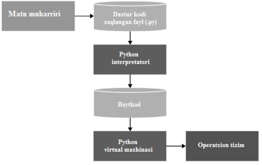

# Kirish
Python - yuqori bosqichli dasturlash tili hisoblanib, tirli xil ilovalarni yaratish
uchun mo'ljallangan. Ya'ni Python dasturlash tili yordamida veb-ilovalar, o'yin
ilovalari, oddiy dasturlar yaratish hamda berilganlar bazasi bilan
ishlash mumkin.  

Ayniqsa Python dasturlash tilining tezlik bilan tarqalishiga uning
mashinali o'rgatish va sun'iy intellekt sohalaridagi tadqiqot ishlarida keng
qo'llanilishi sabab bo'lgan.

Python dasturlash tiliga 1991 yil Golland dasturchisi Grido Van Rossu asos
solgan. Shundan beri ushbu til rivojlanishning ulkan yo'lini bosib o'tdi va 2000
yilda 2.0 versiyasi, 2008 yil esa 3.0 versiyalari chiqarildi. Versiyalar orasidagi
muddatning uzoqligiga qaramasdan doima versiya ostilari chiqariladi. Shunday
qilib, ushbu material eng oxirgi 3.7 versiyasi asosida tuzilgan.

Python dasturlash tilining asosiy xususiyatlari quyidagilardan iborat:
Skriptli til. Dastur kodi skriptlar ko'rinishida bo'ladi;
Turli dasturlash paradigmlarni, xususan ob'ektga yo'naltirilgan va funksional
paradigmlarni o'zida mujassamlagan;

Skriptlar bilan ishlash uchun interpretator kerak bo'lib, u skriptni ishga
tushiradi va bajaradi.

Portativlik va platformaga bog'liqmaslik. Kop'yuterda qanday operasion tizim
Windows, Mac OS, Linux bo'lishidan qat'iy nazar, ushbu operasion tizimda
interpretator mavjud bo'lsa, foydalanuvchi tomonidan yozilgan skript kod
bajariladi.

Xotiraning avtomatik boshqarilishi;  
Turlarga dinamik ajratilishi;  

Pythonda dasturning quyidagicha bajarilishi bo'ladi:
Dastlab mant muharririda ushbu dasturlash tili asosida ifodalar ketma-ketligidan iborat skript
kod yoziladi. Ushbu yozilgan skript kod barajirilish uchun interpretatorga uzatiladi.
Interpretator skript kodni oraliq baytkodga tarjima qiladi. Keyin virtual mashina baytkodni operatsion 
tizimda bajariladigan instruksiyalar (mashina buyruqlari) to'plamiga o'tkazadi.

    

Shu ta'kidlash lozimki, rasman interpretator tomonidan dastlabki kodning
baytkodga tarjima qilinishi va virtual mashinaning ushbu baytkodni mashina
buyruqlari to'plamiga o'tkazilishi ikkita turli jarayon bo'lsada, ammo amalda ular
bitta interpretatorning o'zida birlashtirilgan.

Python juda oddiy dasturlash tili bo'lib, u ixcham shu bilan bir vaqtda sodda
va tushinarli sintaksisga ega. Shu sababli Python o'rganish uchun juda oson til
sifatida butun dunyoda eng tez tarqalayotgan tillardan biri sifatida e'tirof etiladi.
Bundan tashqari ushbu tilda hozirgi kunga kelib, turli sohalarga (veb, o'yin,
mul'timediya, ilmiy tadqiqot) mo'ljallangan katta hajmdagi kutbxonalar majmui
yaratilgan bo'lib, uning tobora mashhurlashib borishiga sabab bo'lmoqda.

## Pythonni o‘rnatish
Pythonda dastur tuzish uchun interpretator kerak
bo'ladi. Uni kompyuteringizdagi o'rnatilgan operasion tizim turiga mos ravishda
https://www.python.org rasmiy saytidan kerakli versiyasini yuklab olishingiz
mumkin.